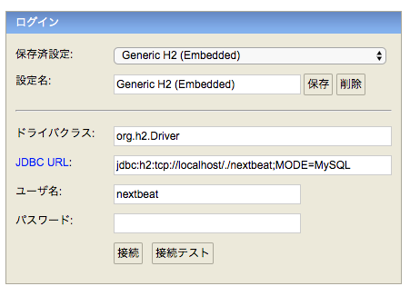
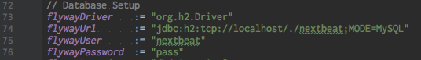

# Quick Start

## Mac

### required

- sbt
- node
- yarn

### DBの作成

今回はH2DBを利用して開発を行います。  
特に断りがない場合、各コマンドはプロジェクトルートから実行してください。

#### H2 Database (RDB) の起動

```
  $ cd database
  $ ./h2.sh &
```

※ ブラウザが起動しますが、DBのmigrateをしていないためまだ操作しないでください。  

#### ユーザ・DBの作成

FlyWayを利用してDBを作成します。

```
  $ sbt
  [SBT] > flywayMigrate
```

#### DBへ接続

JDBC URL:   jdbc:h2:tcp://localhost/./nextbeat;MODE=MySQL  
ユーザ名:   nextbeat  
パスワード: pass  

  

DB作成・接続情報は以下に設定されています。  
任意に変更可能ですが、慣れていない場合にはそのままにすることを推奨します。

`build.sbt`  


### PlayFramework サーバーの起動

#### play secretの設定

##### 秘密鍵の生成

```
  $ sbt
  [SBT] > playGenerateSecret
  Generated new secret: hogehoge
  [success] Total time: 2 s, completed {date}
```

##### 秘密鍵の登録

生成した秘密鍵を設定ファイルに登録します。  

```
[conf/application.conf]
play.http.secret.key   = "hogehoge"
```

#### Typescript / Scss のコンパイル (with ファイル変更監視)

```
  $ cd ui
  $ yarn install
  $ yarn run build.watch
```

#### サーバの起動とトップページの表示

```
  $ sbt run
```

サーバ起動後: http://localhost:9000 へアクセスしてください。  
ページが正常に表示されていれば完了です。


